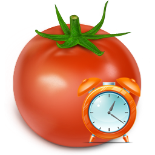
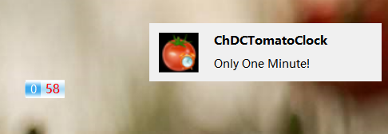
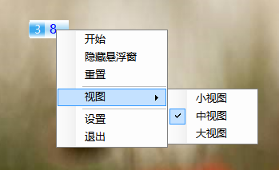
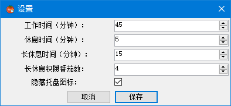

# ChDCTomatoClock

## 简介

用 C# + .NET 实现的基于 Windows 平台的[番茄钟](http://baike.baidu.com/link?url=vVC0BXHnb155jMYRrLjOHq5lrv8t1BCxdV8KarLSyIaseYNIPh5svumtNsyCuUjBWDW_syt__vFWGk_4b6HmL1GDyHNGOqBl9OYHzncwFGUFhImJDuho-uSnLX8RbWsV)。

## 功能

* 支持每隔一定时间后提醒休息一段时间
* 支持集齐N个番茄钟后休息一段长时间

## 软件运行环境

| 项目      | 环境      |
| ------- | ------- |
| 操作系统    | Windows |
| .NET 版本 | 4.0+    |

## 界面截屏

### 主界面（悬浮窗）

左边的数字是当前收集的番茄数，右边的数字是显示当前的剩余时间（单位为分钟）。当剩余时间小于1分钟，会显示红色的倒计时时间（右边的是通知提醒）：

### 菜单页面

### 设置页面

### 托盘图标

